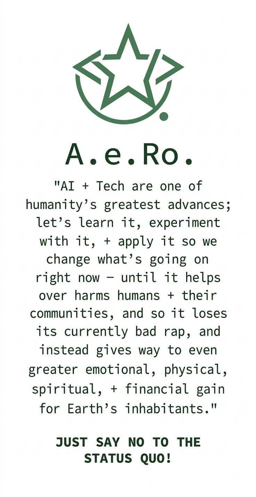

# FOR DEMO ONLY: Raffles Residences Boston · Resident Intranet

**Live demo: [raff-bos-res-demo.vercel.app](https://raff-bos-res-demo.vercel.app/)**

Two years of living at Raffles Residences Boston taught its builder one thing before
anything else: residents want more community · with each other, with the staff who take
such good care of them, and with the building itself. So she built a fully working demo
to find out what software could do about it: a private online home where residents
reserve amenities, request the concierge, pay condo fees, meet neighbours, shop the
marketplace, and take part in building governance · all in one place.

This is an independent portfolio project designed and built by **Ashley Romano**, a
resident of Raffles Residences Boston, from her own unit · not an official Raffles,
Accor, or building-management product. For the full, non-technical story of why it
exists and who built it, run the app and visit **`/about-this-app`** (linked from the
footer and the navigation menu of every page), or read on below for what it does and
how it's built.

> **Demo site only.** Everything shown is simulated · accounts, statements, bookings,
> messages, and even the property-management/hotel integration. No real residents,
> money, or data are involved, and everything lives in your browser (`localStorage`),
> not a server.

## What you can do

A full residential-living experience, rebuilt end-to-end for the browser: real-time-feeling
bookings, a private social network for the building, live governance, and a lightweight
recommendations engine · all dressed in Raffles' quiet, editorial visual language.

### Daily living

| Feature                            | What it does                                                                                                                                                                                                                                                                                                                                                                                                                         |
| ---------------------------------- | ------------------------------------------------------------------------------------------------------------------------------------------------------------------------------------------------------------------------------------------------------------------------------------------------------------------------------------------------------------------------------------------------------------------------------------ |
| **Amenities** (`/amenities`)       | Browse the Residents' Lounge (Floor 21), private dining, spa and more, then reserve a time slot on a visual availability grid, place an in-residence dining order, or explore the full directory of hotel venues · La Padrona, the Long Bar, Guerlain Spa, and beyond.                                                                                                                                                               |
| **Hotel Bridge** (`/hotel-bridge`) | A live-feeling bridge into the hotel's property-management system: pull up your folio, reserve a priority table, or order delivery. Built on a genuine circuit-breaker pattern with caching and retry, so it demonstrates _resilient_ integration design · flip the "simulate outage" switch and watch the app degrade gracefully instead of breaking.                                                                               |
| **Concierge** (`/concierge`)       | Lodge a service request · housekeeping, valet, dry cleaning, a guest arrival, engineering, security, or anything else · and get an on-screen receipt with a reference number the moment it's sent, then track it through to completion with live status updates. Security requests default to priority handling; a standing signpost points Lost & Found reports to their own dedicated page instead of a second, disconnected form. |
| **Account** (`/account`)           | Review monthly statements, pay condo fees, browse payment history, and check a live market-value snapshot for the unit.                                                                                                                                                                                                                                                                                                              |
| **Services** (`/services`)         | Call the valet, report a maintenance issue, request parcel delivery, or log a lost & found item · each with its own status tracking.                                                                                                                                                                                                                                                                                                 |

### Community & social

| Feature                          | What it does                                                                                                                                                            |
| -------------------------------- | ----------------------------------------------------------------------------------------------------------------------------------------------------------------------- |
| **Directory** (`/directory`)     | An opt-in resident directory: control your own visibility and contact preferences, manage household members and pets, and browse neighbours who've chosen to be listed. |
| **Messages** (`/messages`)       | Private one-to-one and group conversations between residents.                                                                                                           |
| **Community** (`/community`)     | A resident forum with interest circles to join, a "Thank You" notes board for building staff, and a curated social feed styled after the building's Instagram presence. |
| **Gallery** (`/gallery`)         | A resident photo wall · uploads are rendered entirely client-side and never leave your browser.                                                                         |
| **Marketplace** (`/marketplace`) | Buy, sell, give away, or crowdsource recommendations from neighbours, with threaded replies on every listing.                                                           |
| **Events** (`/events`)           | RSVP to upcoming events with live capacity limits, pitch new ones, and browse a carousel of highlights from past gatherings.                                            |

### Governance & feedback

| Feature                        | What it does                                                                                                                                     |
| ------------------------------ | ------------------------------------------------------------------------------------------------------------------------------------------------ |
| **Proposals** (`/proposals`)   | A resident idea board · submit, browse, and upvote/downvote what the building should do next.                                                    |
| **Governance** (`/governance`) | Board measures and live ballots, plus the governing documents themselves, embedded and searchable.                                               |
| **Management** (`/management`) | Board and staff bios, building announcements, the full resident handbook, and a monthly satisfaction survey with a staff-only results dashboard. |

### Personalization

| Feature                                                | What it does                                                                                                                                                                                                                |
| ------------------------------------------------------ | --------------------------------------------------------------------------------------------------------------------------------------------------------------------------------------------------------------------------- |
| **For You** (site-wide band + full page at `/for-you`) | A recommendations engine that scores amenities, events, communities, and marketplace listings against your stated interests, bookings, and activity. The signal behind every pick is shown, not hidden · never a black box. |

### Discover the building

**About**, **Press**, and **Sales & Leasing** round things out with brand heritage, press coverage, and current sale/lease/parking listings · no sign-in required. **About This App** (`/about-this-app`, signed with a small green `<AR/>` tag in the footer and the navigation menu, rather than an icon) tells the non-technical story of why this demo exists and who built it.

### Thoughtful details, everywhere

- **Notify security of an issue** (footer, every page · no sign-in required) · a solid-red alert button, deliberately styled apart from ordinary navigation so it doesn't blend in. It opens a pre-filled security email draft _and_ lodges a Priority "Security" request on the same concierge desk queue used by the Concierge page's own Security category · two front doors, one reviewed queue · then confirms with an on-screen reference number either way.
- **"How sign-in & sessions work"** (`/login`) · a dismissible reference covering the passcode, the demo account, profile visibility defaults, household/pet profiles, session length, password reset, which routes require sign-in, and how staff accounts differ · so nothing about the access model is a surprise.
- **Notification bell** (header, site-wide) · surfaces an in-app alert the moment the concierge desk replies to, assigns, or updates one of your requests.
- **Explicit consent for "Remember me"** (`/login`) · turning it on opens a plain-language dialog explaining exactly what gets stored and for how long, before anything is written to your device.
- **One-click "forget me"** (`/directory`) · clears any remembered sign-in details from the browser on demand.
- **Accessible password strength meter** · strength is conveyed through icons and readable text, never colour alone.
- **Demo tags everywhere it matters** · a small "Demo" marker sits on any invented photo, bio, or listing so nothing on screen is ever mistaken for a real resident or real information.

Most pages render for everyone; the interactive parts (booking, posting, voting, messaging,
your account) ask you to sign in first.

## Signing in

This is a **resident preview**, not a real login system · there's no server and no
database. Accounts and sessions live only in `localStorage` on the device you're using,
and disappear if you clear site data or switch browsers. There's no sign-up gate either:
pick whichever of these gets you in fastest.

- **Any listed resident, no registration** · use one of the resident emails shown on the
  sign-in page (e.g. `a.romano@residents.raffles-boston.test`, Residence 22H) with the shared preview
  passcode **`raffles2026`**. This always works, with no account required, for as long as
  the demo exists. Each one is clearly marked **Fictional** on the sign-in page, so it's
  never mistaken for a real resident.
- **Open demo account** · sign in with **`demo@demo.com`** / **`checkitout02116`** (no
  residence number needed). Not every feature is available on this account.
- **Guest passcode access** · type _any_ email address with the passcode `raffles2026`
  and a lightweight resident record is created for you on the spot. It's saved to this
  browser, so the same combination keeps working on later visits · but it's a passcode,
  not a personal password.
- **Register your own household** ("Create account") · this is a real, persistent
  account: a proper email + password saved to this browser's storage. Once created, you
  sign back in with your own password every time · you never have to register twice on
  the same device.
- **Forgot password** (`/reset-password`) is fully simulated end to end: a one-time code
  is shown on screen instead of being emailed, and it expires after 15 minutes or the
  moment you reload the page.

Whichever way you sign in, your **session** lapses automatically after 12 hours of
inactivity (sliding forward while you're active) · at that point you sign in again, you
don't lose or need to recreate the account itself. Turning on **"Remember me"** just
pre-fills your email and residence number on this browser for up to 30 days; it never
stores a password, and it asks for explicit confirmation before saving anything (see
`src/components/RememberMeConsent.tsx`). Because everything is local, a real account only
exists on the device that created it · clearing site data, opening a private window, or
switching machines means starting over, though the always-available seeded emails and the
`raffles2026` passcode remain a fallback that never requires registering anything.

### Staff / building personnel

There's a second, entirely separate account system for building staff, reached via
**Personnel Sign Up / Sign In** at the bottom of the login page (`/staff-signup`,
`/staff-signin`). No staff accounts are seeded · you register once per browser, after
which sign-in works with your own password indefinitely. Unlike resident sessions, a
staff session has **no expiry at all**; you stay signed in until you explicitly sign out.
That said, `/staff-dashboard` is currently an intentionally empty placeholder, and
signing in as staff grants no elevated access anywhere else in the app · it exists to
demonstrate what an internal personnel directory could look like, not to gate any real
functionality.

Two internal tools are protected separately, by a shared access phrase shown right on the
page itself · unrelated to staff accounts entirely:

- **Concierge Desk** (`/concierge-desk`) · the staff-side queue for triaging resident
  requests.
- **Survey results** (inside `/management`) · the monthly satisfaction survey dashboard.

Both use the demo code **`residences-office`**.

## Accessibility

The interface is built to WCAG 2.2 AA: keyboard-navigable throughout, visible focus
outlines, screen-reader labels, and contrast-checked colour throughout. Body text and
headings run at a heavier weight than the site's thin editorial display type would
suggest, specifically so the quiet, hairline-serif aesthetic never comes at the cost of
legibility. Two automated
checks hold that line on every change: an [axe-core](https://github.com/dequelabs/axe-core)
audit (`npm run test:a11y`) scans every public and resident-only page for WCAG 2.0/2.1/2.2
A & AA violations, and a visual regression check (`npm run test:visual`) specifically
guards the header's sign-in controls against overlapping the logo or shrinking below
tap-target size on small screens. Both run in CI on every pull request · see
[Testing](#testing) below.

## Questions or feedback

Want the full story · why this exists, who built it, and what she's up to otherwise · rather than the developer detail below? Visit `/about-this-app` in the running app.

Built with 🤍 in Raffles Residences Boston, Unit 22H by Ashley Romano, 2026 · [ashleye.romano@gmail.com](mailto:ashleye.romano@gmail.com) ·
[978-857-5775](tel:978-857-5775)

---

## For Developers

### Tech stack

- **Framework**: [TanStack Start](https://tanstack.com/start) (file-based routing via
  TanStack Router) on React 19, server-rendered with a Nitro server entry
- **Language**: TypeScript
- **Styling**: Tailwind CSS v4 + [shadcn/ui](https://ui.shadcn.com) primitives
  (`new-york` style, Radix UI underneath) in `src/components/ui/`
- **Build tool**: Vite 8, configured through `@lovable.dev/vite-tanstack-config`
- **Forms/validation**: `react-hook-form` + `zod`
- **Testing**: Vitest + Testing Library (unit/component), Playwright (functional smoke
  test, visual regression, accessibility audit via axe-core), all automated in CI · see
  [Testing](#testing) below

### Architecture notes

This app intentionally has **no real backend for its core features**. That's a
deliberate choice for a portfolio/demo project, not an oversight:

- **Resident & staff data** (`src/lib/portal-store.tsx`, `src/lib/portal-data.ts`,
  `src/lib/staff-store.ts`) live in a React Context, persisted to `localStorage` for
  accounts/sessions/directory data and held purely in memory (reset on reload) for
  everything else · messages, statements, valet/maintenance requests, listings,
  proposals, and votes. There is no database.
- **Supabase** is wired into the framework (`src/integrations/supabase/`,
  `src/start.ts`) but not actually provisioned or used for auth · the `Database` type
  has no tables, and `/health/ready` reports it as `"skipped"` because no Supabase
  credentials are configured. It's scaffolding left in place, not a live dependency.
- **Hotel/PMS integration** (`src/lib/pms.server.ts`, `pms.functions.ts`) is a
  simulated adapter with a deterministic folio generator, a real circuit-breaker
  (trips after 3 failures, half-open retry after 15s), and a short-lived cache · built
  to mirror the shape of a production integration without calling one. Powers
  `/hotel-bridge`.
- **"For You" recommendations** (`src/lib/recommendations.ts`) are rule-based:
  scored from a resident's stated interests, bookings, RSVPs, and open tickets.
- **Error handling**: a server middleware (`src/start.ts`) and client boundary
  (`src/components/AppErrorBoundary.tsx`) catch failures and render a static fallback
  page instead of a blank screen; a runtime logger
  (`src/lib/runtime-error-logger.ts`) also watches for blank-screen conditions.
- **Health checks**: `GET /health` (liveness) and `GET /health/ready` (readiness · reports which optional integrations are actually configured).

### Environment variables

Copy or edit `.env` at the project root:

| Variable                                                     | Purpose                                                                      |
| ------------------------------------------------------------ | ---------------------------------------------------------------------------- |
| `SUPABASE_URL` / `VITE_SUPABASE_URL`                         | Supabase project URL (currently scaffolded, not required for the app to run) |
| `SUPABASE_PUBLISHABLE_KEY` / `VITE_SUPABASE_PUBLISHABLE_KEY` | Supabase anon/publishable key                                                |
| `SUPABASE_PROJECT_ID` / `VITE_SUPABASE_PROJECT_ID`           | Supabase project ID                                                          |
| `GRAPHQL_MESH_URL`                                           | Optional · reported by `/health/ready` if set; not otherwise used            |

None of these are required to run the app locally · every feature works with them unset.

### Getting started locally

Requires **Node.js ≥ 22**.

```sh
git clone <this-repository-url>
cd raffles-residence-hub
npm install
npm run dev
```

The dev server runs at **`http://localhost:8080`** by default (the port Vite reports
on startup may differ if 8080 is in use). Sign in with any resident email + passcode
`raffles2026`, or the open demo account `demo@demo.com` / `checkitout02116`.

### Available scripts

| Script                       | What it does                                                                           |
| ---------------------------- | -------------------------------------------------------------------------------------- |
| `npm run dev`                | Start the Vite dev server                                                              |
| `npm run build`              | Type-check, lint, then build for production                                            |
| `npm run build:dev`          | Same, but built in development mode                                                    |
| `npm run preview`            | Preview a production build locally                                                     |
| `npm run typecheck`          | `tsc --noEmit`                                                                         |
| `npm run lint`               | ESLint (zero warnings allowed)                                                         |
| `npm run format`             | Prettier, write mode                                                                   |
| `npm run check`              | `typecheck` + `lint` (what `build` runs first)                                         |
| `npm test`                   | Run the Vitest unit/component test suite once                                          |
| `npm run test:watch`         | Run the Vitest suite in watch mode while you work                                      |
| `npm run test:smoke`         | Functional smoke test · see below (needs a running server)                             |
| `npm run test:visual`        | Visual-regression check on the header, across 6 breakpoints (needs a running server)   |
| `npm run test:visual:update` | Re-record the visual-regression baseline                                               |
| `npm run test:a11y`          | Accessibility audit via axe-core · see below (needs a running server)                  |
| `npm run test:e2e`           | Runs `test:smoke`, `test:visual`, and `test:a11y` back to back against the same server |

### Testing

Four layers, from fastest/narrowest to slowest/broadest:

1. **Unit & component tests** · Vitest + React Testing Library, in `src/**/*.test.{ts,tsx}`
   next to the code they cover. No server required. Component tests favour behaviour a
   real DOM environment can actually verify (state, focus, ARIA, keyboard flow); anything
   that depends on CSS breakpoints or real layout is left to visual regression instead
   (see `src/components/SiteHeader.test.tsx` for the reasoning). Run with `npm test`, or
   `npm run test:watch` while iterating.
2. **Functional smoke test** (`scripts/smoke-test.mjs`) · hits `/health`, `/health/ready`,
   and every main route over plain HTTP, then drives a real headless browser through the
   demo sign-in flow: unlocking `/account`, `/directory`, and `/messages`; navigating the
   primary nav; watching for console errors; and confirming sign-out re-locks the resident
   areas. Run with `npm run test:smoke`.
3. **Visual regression** (`scripts/visual-header.mjs`) · renders the signed-out header
   across 6 real mobile/tablet breakpoints and checks its measured geometry against a
   recorded baseline (`tests/visual/header-baseline.json`): no overlap between the
   sign-in/sign-up buttons and the logo, no horizontal clipping, and a minimum 40px tap
   target. Run with `npm run test:visual`; re-record intentional layout changes with
   `npm run test:visual:update`. Screenshots land in `tests/visual/output/` (git-ignored).
4. **Accessibility audit** (`scripts/a11y-audit.mjs`) · an [axe-core](https://github.com/dequelabs/axe-core)
   scan (via `@axe-core/playwright`) of every public route plus the signed-in resident
   areas, checked against WCAG 2.0/2.1/2.2 A & AA rules. `serious`/`critical` violations
   fail the run; `moderate`/`minor` findings are printed but don't block. Run with
   `npm run test:a11y`.

Layers 2–4 drive a real browser via Playwright and need the app already running. In one
terminal:

```sh
npm run dev          # or: npm run build && npm run preview
```

...then in another:

```sh
npm run test:e2e                                    # all three, against http://localhost:8080
SMOKE_BASE_URL=https://your-staging-url npm run test:e2e   # or against a deployed build
```

(`test:visual` and `test:a11y` read `VISUAL_BASE_URL` / `A11Y_BASE_URL` respectively if
you'd rather point them at different URLs individually.) The first run of any Playwright
script downloads Chromium if it isn't already cached: `npx playwright install chromium`.

#### Continuous integration

[`.github/workflows/ci.yml`](.github/workflows/ci.yml) runs on every push to `main` and
every pull request: one job for `check` + the unit suite, then a second job that builds
the app, boots a preview server, and runs the smoke, visual, and accessibility suites
against it · uploading the visual-regression screenshots as a build artifact either way.
Node is pinned to the 22.x line in CI; see the comment in `src/test/setup.ts` if you hit
storage-related test failures on a different local Node version.

### Project structure

```text
.github/workflows/ CI pipeline (typecheck/lint/unit, then smoke/visual/a11y against a preview build)
src/
  routes/         File-based routes (TanStack Router) · one file per URL, see src/routes/README.md
  components/     Page-level components; src/components/ui/ holds shadcn primitives
  lib/             Data models, business logic, and server functions (portal store, PMS, recommendations, auth, etc.)
  integrations/    Supabase client setup (scaffolded, not actively used)
  test/            Vitest setup (jsdom polyfills · see src/test/setup.ts)
  assets/          Images
scripts/           Smoke test, visual-regression, and accessibility-audit tooling
tests/visual/      Visual-regression baseline and output
```

Routing follows TanStack Start's file-based conventions · see
[src/routes/README.md](src/routes/README.md) for the naming rules. `src/routeTree.gen.ts`
is auto-generated; don't edit it by hand.

### Contributing

I welcome contributions! Please:

1. Fork the repository
2. Create a feature branch (`git checkout -b feature/your-feature`)
3. Run `npm run check` and `npm test` before pushing · and if your change touches
   layout, navigation, or an authenticated flow, run `npm run test:e2e` against a local
   dev server too (see [Testing](#testing))
4. Commit your changes (`git commit -am 'Add feature'`)
5. Push to the branch (`git push origin feature/your-feature`)
6. Open a Pull Request with a clear description · CI runs the full suite automatically

### Report bugs or suggest features



Found an issue or have a suggestion? Please contact Ashley, or open an issue on GitHub:

- **Email**: [ashleye.romano@gmail.com](mailto:ashleye.romano@gmail.com)
- **Phone**: [978-857-5775](tel:978-857-5775)
- **GitHub**: [github.com/ashleyer/raff-res-hub-demo](https://github.com/ashleyer/raff-res-hub-demo)

Include as much detail as possible about the bug or feature request.

---

built with 🤍 in Raffles Residences Boston, Unit 22H by Ashley Romano, 2026
