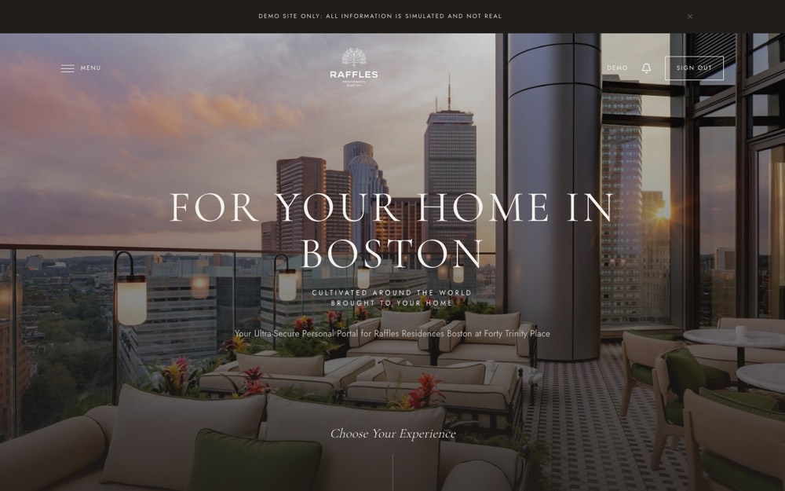
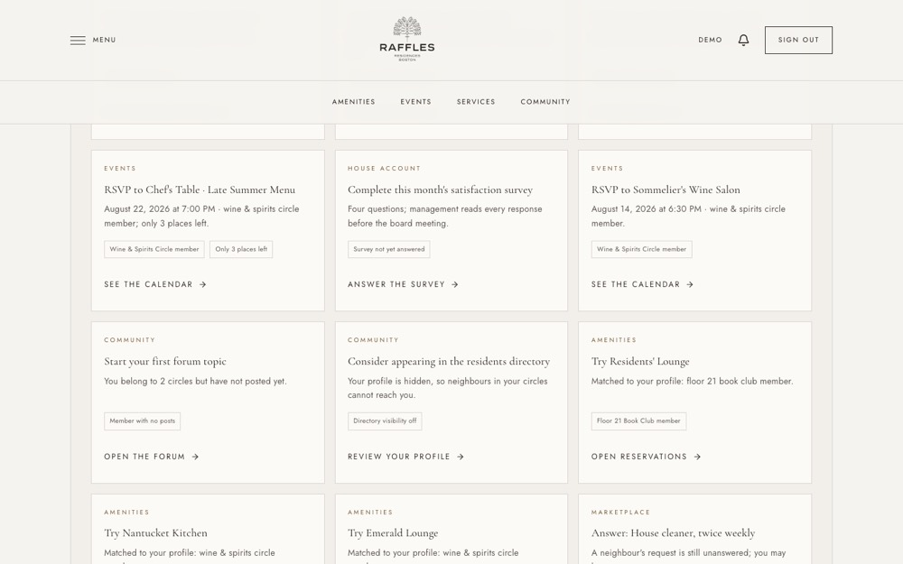
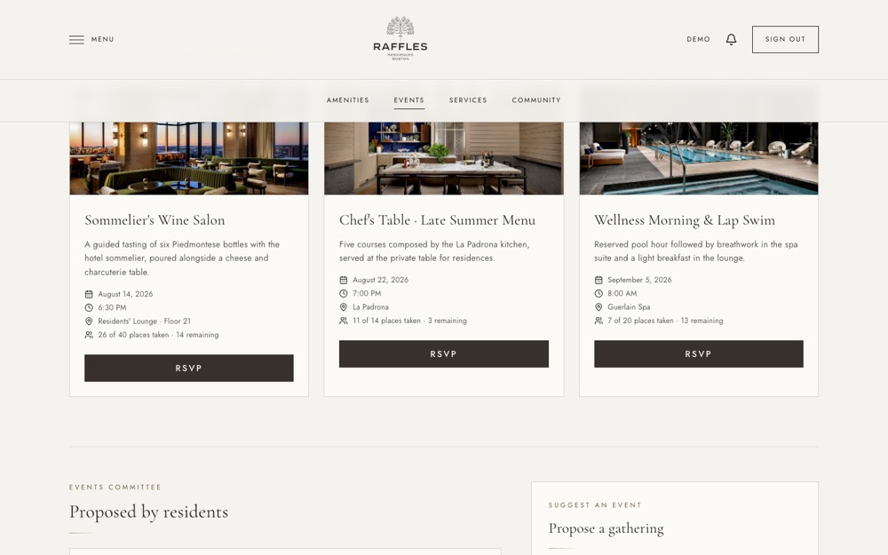
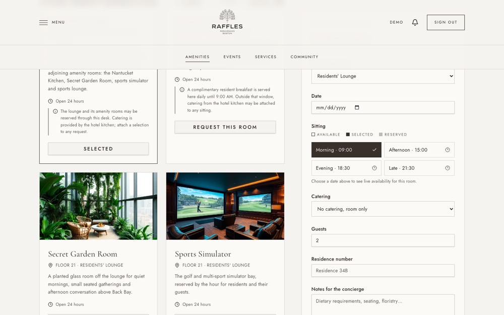
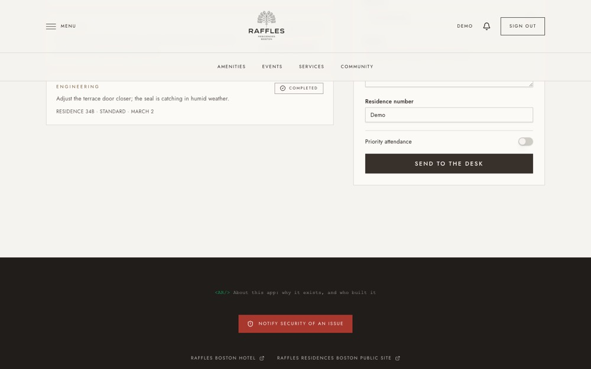

# Resident Portal — Design Review

**Reviewed 2026-08-15** · live demo, desktop (1440×900) + mobile (390×844), signed-in and
signed-out states, 20 screens · [annotated version with full write-up →](https://claude.ai/code/artifact/af6cc0b6-9137-465d-96f0-c56740d4256f)

A hospitality-software and UX critique of the resident portal, done by driving the live
demo with Playwright rather than reading the source in isolation. Open findings below are
tracked as GitHub issues (linked inline) rather than left as prose, so they don't go stale.

## Verdict

This is an unusually complete piece of hospitality software for a solo build. The visual
language, the content voice, and the information architecture all clear a bar most funded
proptech doesn't reach — in places it's genuinely mistakable for a real Raffles product.
The gaps that remain aren't taste problems; they're the specific seams where a bespoke
interface meets browser defaults, and where transactional moments still borrow the pacing
of a marketing page.

## Scorecard

| Dimension | Read | Note |
| --- | --- | --- |
| Brand & visual fidelity | ●●●● | Could sit next to rafflesresidencesboston.com without flinching. |
| Hospitality voice | ●●●● | Concierge notes and resident quotes read like a real desk log, not filler copy. |
| Information architecture | ●●●○ | Fourteen resident domains, all two clicks away; the mega-menu earns its keep. |
| Transactional UX | ●●○○ | The patterns are right; the input chrome breaks the spell. |
| Accessibility discipline | ●●●○ | Contrast bugs get caught and documented, not just silently patched. |
| Mobile experience | ●●●○ | Header survives real stress-testing; forms feel less tailored under 768px. |
| Staff-side operations | ●○○○ | The resident half is finished. The desk that resolves those requests isn't. |

## What's already five-star

**The homepage as thesis.** One cinematic photograph, a headline set in a light
transitional serif, a single soft prompt — *Choose Your Experience* — instead of a wall of
navigation. It borrows the actual rhythm of luxury-hospitality marketing sites.

**The personalization engine shows its work.** Every card on `/for-you` carries the reason
it appeared — *"Matched to your profile: wine & spirits circle member,"* *"You belong to 2
circles but have not posted yet."* Most consumer software treats recommendations as a
black box; this treats them as a concierge's reasoning, said out loud.

**The Hotel Bridge outage toggle.** PMS integrations are one of the most failure-prone
parts of real hospitality tech. Hotel Bridge is built on an actual circuit-breaker pattern
and ships a "Simulate outage" switch that shows graceful degradation instead of pretending
failure never happens — the clearest piece of leader-level systems thinking in the build.

**Micro-copy that thinks like a concierge, not a database.** RSVP cards state exact
scarcity — *"11 of 14 places taken · 3 remaining"* — instead of a vague "almost full"
badge; governance ballots show real vote counts. That precision is carried consistently
across events, ballots, and reservations.

**Accessibility as a practiced habit, not a checkbox.** `src/styles.css` documents a gold
accent color that was deliberately darkened after it measured 4.31:1 against a panel
background — short of WCAG AA's 4.5:1 — caught by the automated audit. Paired with the
visual-regression suite guarding the header across six breakpoints, this reads like a team
with a QA discipline, not a single designer's taste.

## Open findings

Ranked by how much each one costs the illusion, not by how hard it is to fix. Tracked
individually so they can be closed out one at a time:

1. **Browser-native inputs inside a couture interface** — every date/time field
   (Amenities, Concierge, Hotel Bridge) drops to the raw OS picker. `react-day-picker` is
   already a dependency and unused exactly where it's needed most. → [#9](https://github.com/ashleyer/raff-res-hub-demo/issues/9)

   

2. **Button type sized for browsing, not for spending money** — transactional CTAs
   (*Send to the Desk*, *Place Order*, *Publish Listing*) run at the same ~10–11px tracked
   caps as marketing-page buttons. → [#10](https://github.com/ashleyer/raff-res-hub-demo/issues/10)

3. **Uneven column weight leaves dead space on wide screens** — Concierge's two-column
   layout leaves a wide field of blank space before the footer when the request list is
   short. → [#11](https://github.com/ashleyer/raff-res-hub-demo/issues/11)

   

4. **Two "this isn't real" interruptions before anything real is seen** — the banner and
   the first-visit modal both restate the same fact, and the modal's only dismissal is a
   small unlabeled corner icon. → [#12](https://github.com/ashleyer/raff-res-hub-demo/issues/12)

5. **Currency formatting overstates precision** — the house-value snapshot on Account
   renders seven-figure numbers to the cent (`$6,240,000.00`). → [#13](https://github.com/ashleyer/raff-res-hub-demo/issues/13)

## If I were briefing the next sprint

- **Build out the staff side.** Every flow reviewed here ends by being "lodged," and
  Concierge Desk is where it's triaged, assigned, and closed — currently the thinnest part
  of the build, with `/staff-dashboard` an acknowledged placeholder.
- **Carry the visible-logic idea further.** Extend the "For You" page's transparent
  reasoning to concierge status updates and governance outcomes, so transparency becomes
  the site's throughline rather than one page's feature.

---

*None of this reads as a portfolio piece pretending to be software. It reads as software
that happens to also be a portfolio piece — which is the harder thing to build.*
